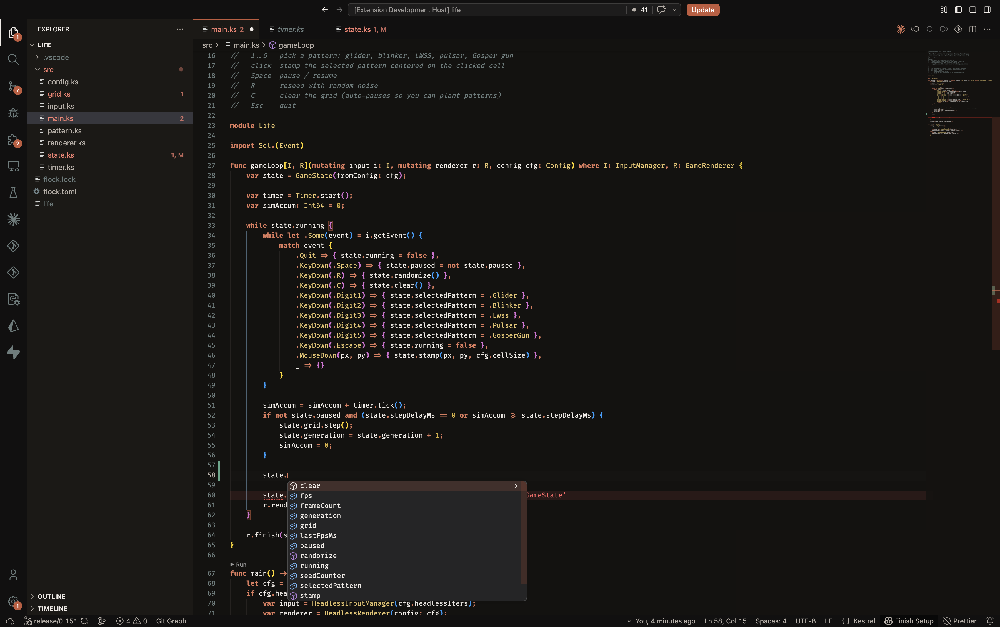
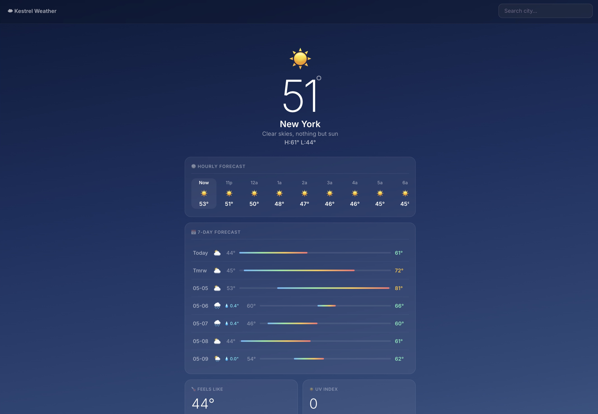
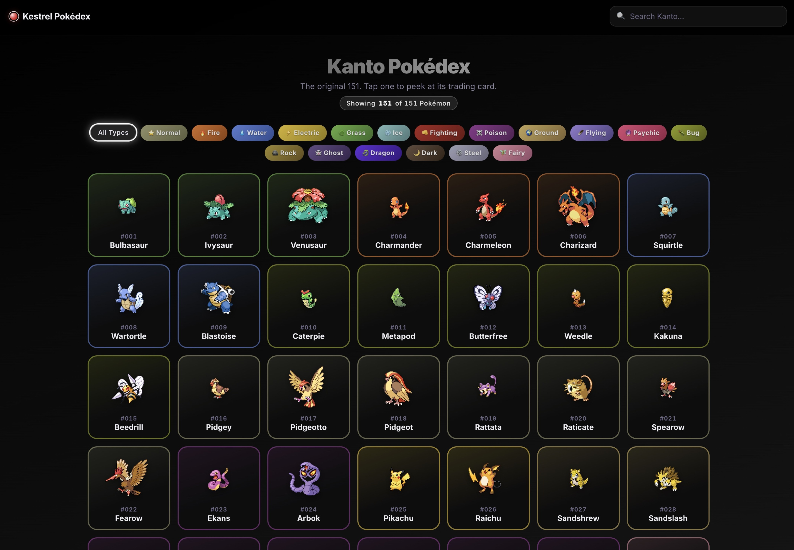
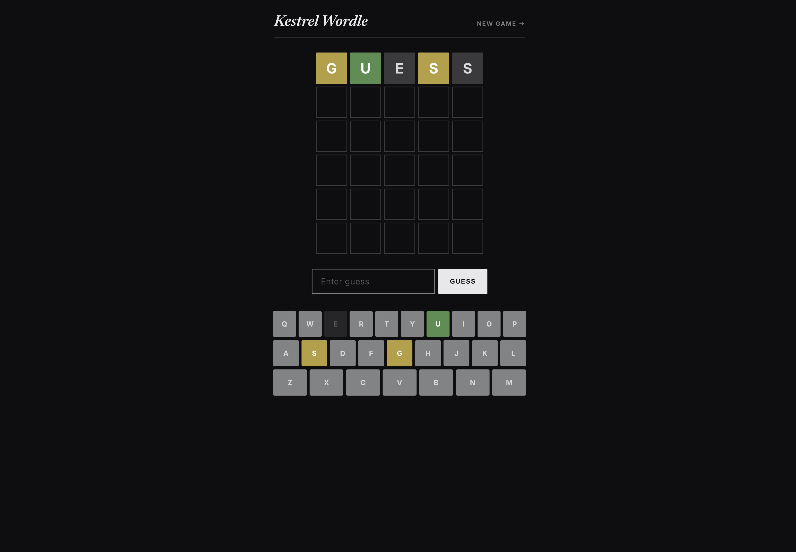
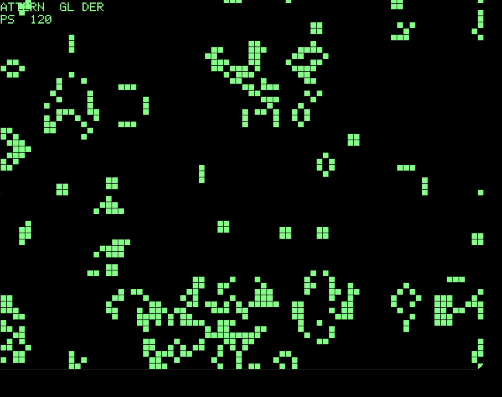
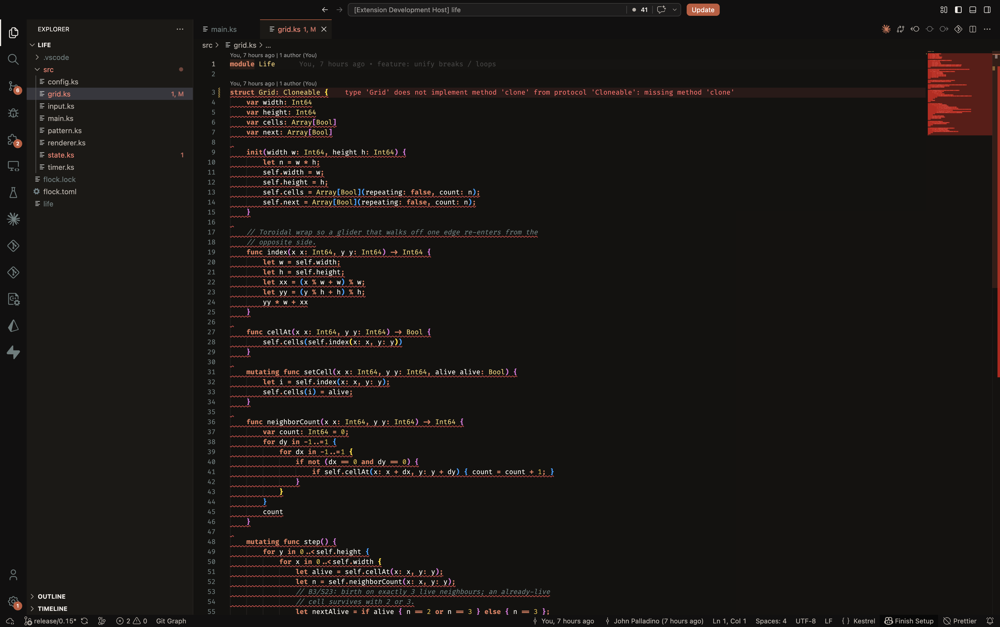

<p align="center">

</p>

<h1 align="center">Kestrel</h1>

<p align="center">
Clean syntax. Powerful types. Deterministic memory.
</p>

<p align="center">
<a href="https://kestrel-lang.com"></a>
<a href="LICENSE"></a>
</p>

<p align="center">

</p>

<p align="center">



</p>
<table align="center"><tr>
<td align="center" valign="middle"></td>
<td align="center" valign="middle"></td>
</tr></table>

## What is Kestrel?

Kestrel is a compiled programming language with deterministic memory management — no garbage collector, no borrow checker. It compiles to native code via Cranelift and ships with a full ecosystem: package manager, web framework, HTTP client, VS Code extension, and more — many written in Kestrel itself.

Currently in its first preview release, Kestrel can be used to write 2D games, CLI tools, and web apps.

## Quick Start

```bash
# Install Kestrel
curl --proto '=https' --tlsv1.2 -sSf https://kestrel-lang.com/install.sh | sh

# Run a program
kestrel run hello.ks

# Or use Flock (package manager)
flock new myproject && cd myproject && flock run
```

Or [build from source](#building-from-source) if you prefer.

## Contents

- [A Taste of Kestrel](#a-taste-of-kestrel)
- [Features](#features)
- [Ecosystem](#ecosystem)
- [Examples](#examples)
- [Editor Support](#editor-support)
- [Standard Library](#standard-library)
- [Building from Source](#building-from-source)

## A Taste of Kestrel

```kestrel
module Cafe

enum Roast {
    case Light
    case Dark
    case Custom(String)
}

struct Order {
    let drink: String
    let roast: Roast
    let shots: Int64

    var price: Int64 { self.shots * 250 }

    func receipt() -> String {
        let roast = match self.roast {
            .Light => "light",
            .Dark => "dark",
            .Custom(name) => name
        }
        "\(self.drink) (\(roast)) — $\(self.price / 100)"
    }
}

func main() {
    let orders = [
        Order(drink: "Cortado", roast: .Dark, shots: 2),
        Order(drink: "Oat Latte", roast: .Light, shots: 3),
    ];

    orders.filter { it.shots > 2 }.forEach { println(it.receipt()) };
}
```

## Features

### Type System

- **Protocols and extensions** — polymorphism with retroactive conformance
- **Monomorphized generics** — zero-cost abstractions with `where` clause constraints
- **Algebraic data types** — enums with associated values and exhaustive pattern matching
- **Type inference** — bidirectional constraint-based inference

### Memory Model

- **Value semantics** — copy-on-assignment, `not Copyable` for move-only types
- **Copy-on-write collections** — Array, Dictionary, Set
- **RAII** — deterministic cleanup via `deinit`
- **No GC, no borrow checker** — ownership is simple and predictable

### Ergonomics

- **Error handling** — `throws` / `try` sugar over `Result[T, E]`
- **Closures** — trailing closure syntax, implicit `it` parameter
- **String interpolation** — `"\(expr)"` via the Formattable protocol
- **Iterators** — `for`-`in` loops with 20+ adapters (map, filter, zip, scan, take, ...)
- **C interop** — `@extern(.C)` for calling C functions and linking native libraries
- **Parameter labels** — named parameters for readable call sites

## Ecosystem

Kestrel ships with **Flock**, a package manager written in Kestrel:

```bash
flock init myproject && cd myproject
flock run
```

Available packages:

| Package | Description |
| --- | --- |
| [kestrel/perch](https://kestrel-lang.com/flock/kestrel/perch) | Web framework — routing, middleware, generic context |
| [kestrel/swoop](https://kestrel-lang.com/flock/kestrel/swoop) | HTTP/HTTPS client |
| [kestrel/clutch](https://kestrel-lang.com/flock/kestrel/clutch) | CLI argument parser |
| [kestrel/quill](https://kestrel-lang.com/flock/kestrel/quill) | Serialization framework |
| [kestrel/quill-json](https://kestrel-lang.com/flock/kestrel/quill-json) | JSON support for Quill |
| [kestrel/quill-toml](https://kestrel-lang.com/flock/kestrel/quill-toml) | TOML support for Quill |
| [kestrel/http](https://kestrel-lang.com/flock/kestrel/http) | Shared HTTP types |
| [kestrel/plume](https://kestrel-lang.com/flock/kestrel/plume) | Template engine |
| [kestrel/talon-sqlite](https://kestrel-lang.com/flock/kestrel/talon-sqlite) | SQLite Wrapper |

Also included: **Jessup** (toolchain version manager, like rustup).

## Examples

| Example | Description | Complexity |
| --- | --- | --- |
| [Notes App](examples/notes-frontend/) | Full-stack web app with htmx, perch backend, and SQLite database | Advanced |
| [Weather Dashboard](examples/weather) | Full-stack web app with Perch, htmx, and Open-Meteo API | Advanced |
| [Pokédex](examples/pokedex) | Kanto Pokédex using PokéAPI, Perch, and Plume | Advanced |
| [Wordle](examples/wordle) | Wordle clone with shareable URL state | Intermediate |
| [APOD](examples/apod) | NASA Astronomy Picture of the Day viewer | Intermediate |
| [Counter](examples/counter) | HTMX counter app with Perch | Beginner |
| [Game of Life](examples/life) | Conway's Game of Life with SDL2 | Intermediate |
| [Breakout](examples/breakout) | Terminal brick breaker with Iterator-based game loop | Intermediate |
| [Snake](examples/snake) | Terminal snake with RAII terminal management | Intermediate |
| [Pong](examples/pong) | Terminal pong with AI opponent | Intermediate |
| [SDL Pong](examples/sdl_pong) | Graphical pong via SDL2 FFI bindings | Intermediate |

## Editor Support

Kestrel ships with a language server (`kestrel-lsp`) with diagnostics, completions, go-to-definition, rename, and more. Install the [VS Code extension](https://github.com/kestrellang/vscode-kestrel) to get started.

<p align="center">

</p>

## Standard Library

All public stdlib types are auto-imported — no `import` statements needed. See the full [Standard Library Reference](https://kestrel-lang.com/reference/stdlib).

## Status

Kestrel is in early preview — expect breaking changes between releases.

- **macOS** is the primary platform; **Linux** is supported but less tested
- **No optimized release profile** yet — binaries are unoptimized
- **Windows** is not currently supported

## Building from Source

Requires Rust 2024 edition (1.85+).

```bash
git clone https://github.com/kestrellang/kestrel
cd kestrel
cargo install --path .
```

## License

Apache-2.0 — see [LICENSE](LICENSE).
